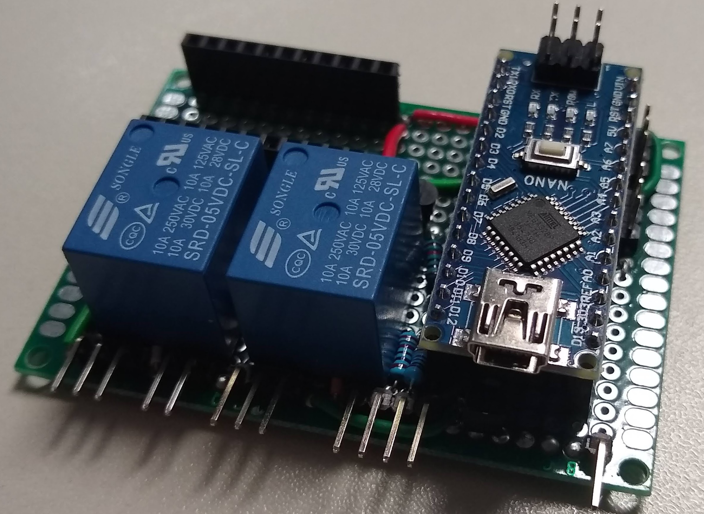
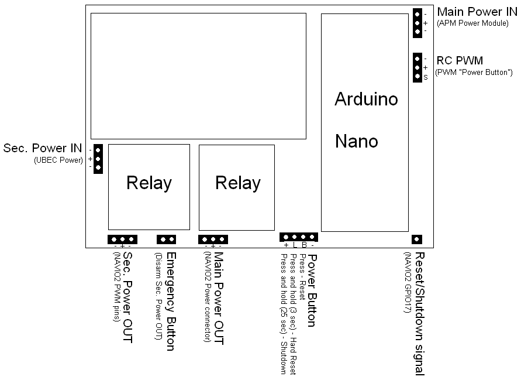
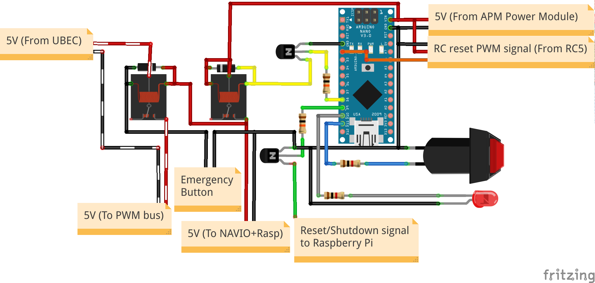

# usv-arduino
Arduino-based backup processor for LSA's boats

## Description
Every USV in our Lab is based on Raspberry Pi boards running ROS. To prevent data corruption, our implementation uses a tiny board which provides power control and signals to prevent that happens. In parallel, others software capabilities could be added as a backup data link providing power control and Raspberry data exchange.

## Functionalities

Figure 1: Power control board.

The Power Control Board, showed in Fig. 1, is based in Arduino Nano solution. With only one button, this board is able to provide the follow functions:
* Power on
* Reset (Software based reset)
* Hard Reset (Software shutdown and power off/on)
* Shutdown (Software shutdown and power off)
Parallel to that, this board includes an Emergency button  with controls the PWM bus power. In this way, it is possible disable any servo or ESC to act without PWM controller interference.
Alternatively, it is possible to add an PWM signal (from a RC channel) to act as the power button to provides similar behavior remotely.
The interconnection block diagram is shown in Fig. 2.

Figure 2: Block diagram of power control board.

## Implementation
The board has an Arduino Nano which receives two signals: button and PWM. Based on they, the Arduino control an relay allowing 5V from APM Power Module to be distributed to Raspberry Pi. This 5V also power on the second relay wich provides the 5V from UBEC to the PWM bus. However, an Emergency button in series with this second relay control signal can disable it disabling any servo or ESC action. To this functionality works, it is necessary remove any power source from servo or ESC to PWM bus. More details is available in Fig. 3.

Figure 3: Power Control Board schematic.

The Reset/Shutdown signal to Raspberry Pi indicates the power operation. Running at Raspberry, a phyton script monitors the GPIO pin and executes reboot or shutdown operation according to it.

## Operation
The power button can provides 4 operations as shown previously. The difference between them is the previous state and the time holding on the button. The LED inside button indicates the current state:
* LED off -> Power off;
* LED blinking -> Raspberry Pi is booting/restarting/shutting down;
* LED on -> Power on.

Button operation:
* Power on
  * Previous state: LED off
  * Procedure: press the power button
* Reset
  * Previous state: LED on
  * Procedure: press the power button (less than 1 second)
* Hard Reset
  * Previous state: LED on
  * Procedure: press the power button for 3 seconds
* Shutdown
  * Previous state: LED on
  * Procedure: press the power button for 25 seconds or until the LED is stable off
This long time is necessary to eliminate any false intetion to shutting down.

It is **highly recommended** disable PWM bus power through Emergency button every time when the robot is not in operation to prevent injures.
